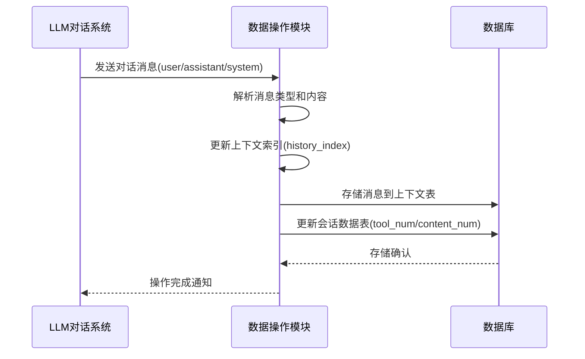
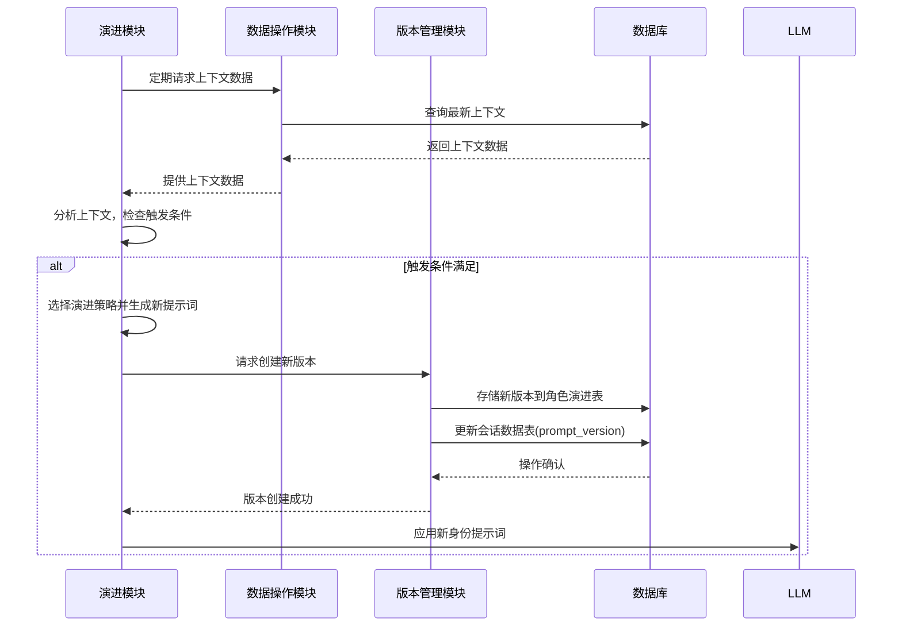
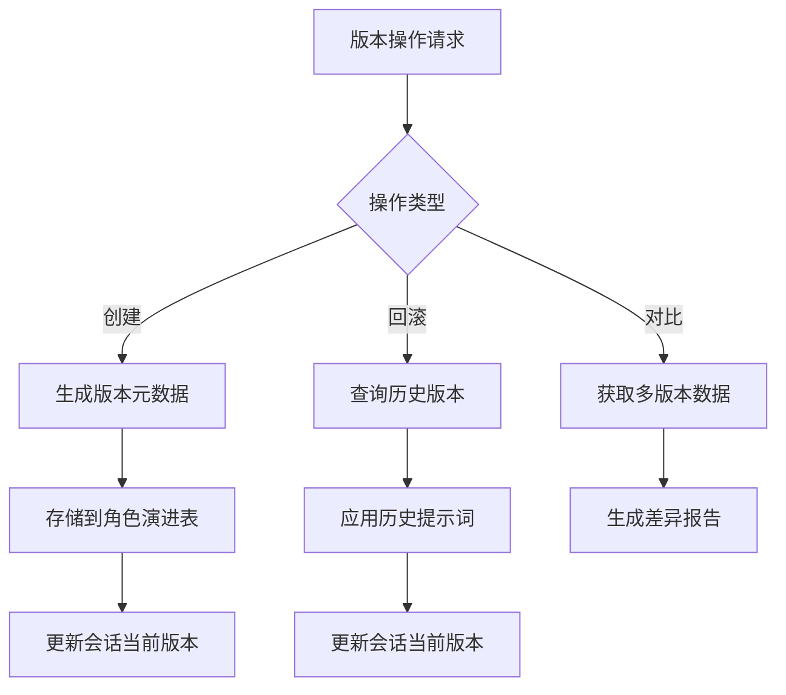
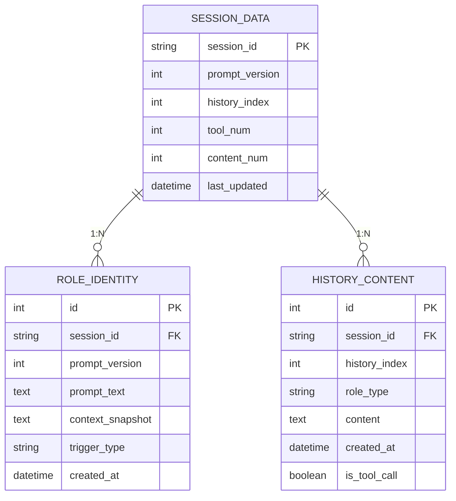

# astrbot_plugin_chameleon 开发文档

## 1. 功能模块

### 1.1 数据持久化模块
- **功能描述**：负责所有数据的存储和检索
- **核心职责**：
    - 数据库连接管理
    - 数据表结构维护
    - 数据读写操作封装

### 1.2 数据操作模块
- **功能描述**：处理上下文数据的实时监控与记录
- **核心职责**：
    - 监听LLM对话流
    - 捕获并记录所有交互内容
    - 维护上下文索引
    - 分析上下文内容（关键词检测、情感分析）

### 1.3 演进模块
- **功能描述**：负责角色身份的演进处理
- **核心职责**：
    - 触发条件检测（事件/轮次/时间）
    - 上下文分析评估
    - 演进策略选择（预设/填充/自由）
    - 新提示词生成
    - 身份无缝切换

### 1.4 版本管理模块
- **功能描述**：管理角色身份的历史版本
- **核心职责**：
    - 版本创建与存储
    - 版本元数据管理
    - 版本差异对比
    - 版本回滚操作
    - 快照管理

---

## 2. 工作流程

### 2.1 数据监控与持久化流程


### 2.2 演进触发与处理流程


### 2.3 版本管理流程


---

## 3. 文件结构

```
astrbot_plugin_chameleon/
├── core/                       # 核心功能模块
│   ├── data_persistence.py     # 数据持久化模块
│   ├── data_operations.py      # 数据操作模块
│   ├── evolution_engine.py     # 演进模块
│   └── version_manager.py      # 版本管理模块
├── models/                     # 数据模型定义
│   ├── session_data.py         # 会话数据模型
│   ├── role_identity.py        # 角色演进模型
│   └── history_content.py      # 上下文模型
├── database/                   # 数据库相关
│   ├── __init__.py             
│   ├── db_connection.py        # 数据库连接
│   ├── history_content_repository.py   # 上下文数据操作
│   ├── role_identity_repository.py   # 角色演进数据操作
│   ├── session_repository.py   # 会话数据操作
│   └── models.py               # 数据模型定义
├── utils/                      # 工具函数
│   ├── trigger_detector.py     # 触发检测工具
│   ├── diff_generator.py       # 差异对比工具
│   └── context_analyzer.py     # 上下文分析工具
├── config/                     # 配置文件
│   ├── default.yaml            # 默认配置
│   └── __init__.py             # 配置加载器
└── main.py                     # 插件入口
```

---

## 4. 数据库结构

### 4.1 会话数据表 (session_data)
```python
@dataclass
class SessionData:
    session_id: str       # 会话唯一标识 (主键)
    prompt_version: int   # 当前使用的角色提示词版本 (默认0)
    history_index: int    # 当前上下文总长度（消息计数）
    tool_num: int         # 工具调用消息数量
    content_num: int      # 用户互动消息数量
    last_updated: datetime # 最后更新时间
```

### 4.2 角色演进表 (role_identity)
```python
@dataclass
class RoleIdentity:
    id: int               # 版本记录ID (主键)
    session_id: str       # 所属会话ID (外键)
    prompt_version: int   # 提示词版本号
    prompt_text: str      # 角色提示词内容 (长文本)
    context_snapshot: str # 触发时的上下文快照
    trigger_type: str     # 触发类型 (事件/轮次/时间)
    created_at: datetime  # 版本创建时间
```

### 4.3 上下文表 (history_content)
```python
@dataclass
class HistoryContent:
    id: int               # 记录ID (主键)
    session_id: str       # 所属会话ID (外键)
    history_index: int    # 消息在会话中的顺序位置
    role_type: str        # 消息类型: 'user'/'assistant'/'system'
    content: str          # 消息内容 (长文本)
    created_at: datetime  # 消息创建时间
    is_tool_call: bool    # 是否为工具调用消息
```

### 4.4 索引设计
```sql
-- 会话数据表索引
CREATE INDEX idx_session ON session_data(session_id);

-- 角色演进表索引
CREATE INDEX idx_role_session ON role_identity(session_id);
CREATE INDEX idx_role_version ON role_identity(prompt_version);

-- 上下文表索引
CREATE INDEX idx_history_session ON history_content(session_id);
CREATE INDEX idx_history_index ON history_content(history_index);
```

### 4.5 数据库关系图

