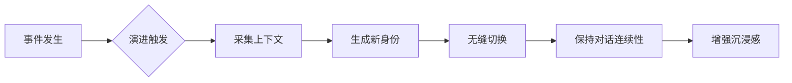

# astrbot_plugin_chameleon 需求文档
> **让角色身份动态演进**

---

## 1. 需求背景
### 1.1 核心问题
在长期角色扮演互动中：
- 角色经历重大事件（战争、情感变化、成长等）后，**身份和性格需自然演变**
- 仅依赖上下文记忆无法实现**自然且稳定的身份/性格转变**，随着互动继续，最旧的上下文逐渐丢失，这些转变会消失乃至变得诡异
- 固定提示词导致角色行为与经历**产生矛盾**，破坏沉浸感

### 1.2 现状局限
| 现有方案 | 缺陷 |  
|---------|------|  
| 上下文窗口 | 仅短期记忆，无法体现根本性转变 |  
| 固定提示词 | 角色行为与经历发展脱节 |  
| 手动修改 | 中断互动流程，且需要管理员操作，破坏沉浸体验 |  

---

## 2. 核心需求目标
**提升长期角色扮演的沉浸感**，通过：  
✅ **身份动态演进**：角色提示词随经历自然演变

---

## 3. 核心功能需求
### 3.1 状态追踪系统
| **组件** | **需求描述** |  
|----------|-------------|  
| **上下文管理** | 持久保存上下文 |  
| **角色演进** | 多种触发条件，触发角色演进 |  
| **风险控制** | 身份演进自动备份，允许回滚 |  

### 3.2 演进触发机制
| **触发类型** | **触发条件** | **示例场景** |  
|-------------|-------------|-------------|  
| 重大事件 | 预设关键词触发（死亡/婚礼/背叛） | 角色经历"战友死亡"事件 |  
| 互动积累 | 达到设定对话轮次阈值（如每80轮） | 长期互动后自然成长 |  
| 自主演进 | LLM定期分析对话上下文 | 检测到角色信念动摇 |  
| 休眠响应 | 超过设定未互动天数（如7天） | 回归后角色呈现时间流逝变化 |  

### 3.3 身份演进引擎
| **模式** | **实现方式** | **适用场景** |  
|----------|-------------|-------------|  
| 预设剧本 | 加载用户预定义演进路径 | 线性故事发展 |  
| 动态填充 | LLM根据模板变量生成内容 | 半结构化转变 |  
| 自由演化 | 完全由LLM自主生成 | 开放型成长 |  
| 混合策略 | 结合预设框架与动态生成 | 复杂角色弧 |  

### 3.4 沉浸感保障机制

---

## 4. 数据管理需求
### 4.1 深度持久化存储
- **完整历史归档**：
   - 存储所有提示词版本及对应事件上下文
- **关系演变追踪**：
   - 记录角色演进的变化图谱

### 4.2 数据导出功能
| **导出类型** | **内容格式** |  
|-------------|-------------|  
| 演进史 | 文本、长图 |  
| 角色传记 | 自然语言叙述的成长历程 |  
| 大事件集 | 时间线形式的事件摘要 |  

### 4.3 版本控制系统
| **功能** | **需求描述** |  
|----------|-------------|  
| 一键回滚 | 恢复到任意历史版本（不保留后续演进分支） |  
| 差异对比 | 高亮显示版本间属性变化 |  
| 快照标记 | 触发演进自动创建存档点 |  

---