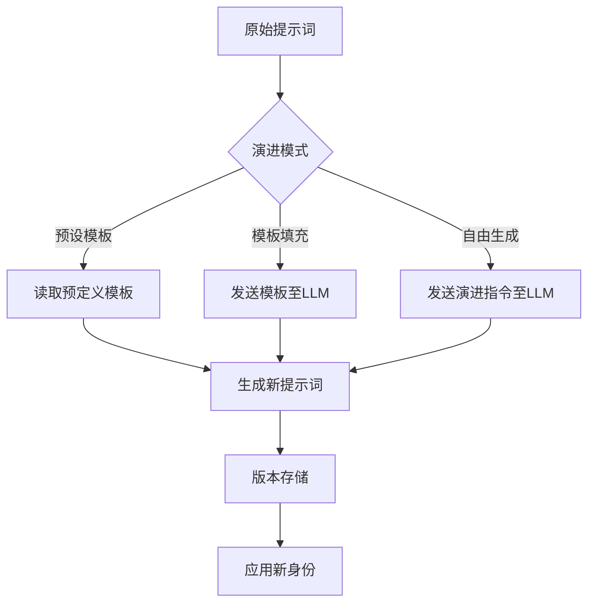

# astrbot_plugin_chameleon 开发需求文档
> 提供角色身份动态演进能力

## 1. 项目背景
在长期角色扮演互动中，固定身份提示词会导致沉浸感断裂（如角色经历重大事件后性格、身份转变）。本插件通过**动态重写角色提示词**，实现身份的自然演进，增强用户体验。

---

## 2. 核心功能
### 2.1 状态追踪系统
| 组件 | 功能描述 |  
|------|----------|  
| **角色属性存储** | 持久化存储角色当前属性（性格、关系、经历状态） |  
| **事件时间轴** | 记录关键事件及发生轮次（格式：`[轮次]事件摘要`） |  
| **互动计数器** | 统计累计互动次数和最近互动时间戳 |  

### 2.2 演进触发器（灵活可配置）
```yaml
# 示例配置
triggers:
  frequency:  # 基于互动频率
    threshold: 50  # 每50轮触发
  inactivity: # 长时间未互动
    days: 7        # 7天无互动时触发
  llm_judgment:   # LLM事件判断
    interval: 20   # 每20轮发送上下文给LLM评估
    prompt: "是否存在导致角色身份转变的关键事件？" 
  custom_events:   # 自定义事件
    keywords: ["死亡", "背叛", "婚礼"] 
```

### 2.3 演进方向控制（多模式支持）
#### 演进策略矩阵
| 模式 | 描述 | 适用场景 |  
|------|------|----------|  
| **预设模板** | 加载用户预定义的演进路径 | 剧本式结构化演进 |  
| **LLM模板填充** | 提供模板变量由LLM生成内容<br>`{{角色名}}从{{旧状态}}变为{{新状态}}` | 平衡可控性与创造性 |  
| **自由生成** | 完全由LLM生成新提示词 | 开放式自然演进 |  
| **混合模式** | 结合预设模板与LLM生成 | 高灵活性需求 |  

### 2.4 提示词重写引擎


### 2.5 数据持久化与回滚
```json
{
  "character_id": "knight_001",
  "current_version": 3,
  "evolution_log": [
    {
      "version": 1,
      "prompt": "年轻的骑士...",
      "trigger": "init",
      "timestamp": "2025-06-01T10:00:00Z"
    },
    {
      "version": 2,
      "prompt": "经历过战争的骑士...",
      "trigger": "event:war",
      "context_snapshot": "用户说：'战场太残酷了'..."
    }
  ]
}
```

---

## 3. 技术规范

### 3.1 演进工作流程
1. **触发检测**：实时监测对话流中的触发条件
2. **上下文采集**：捕获最近N轮关键对话上下文
3. **演进策略选择**：根据配置选择演进生成模式
4. **提示词生成**：执行选定的演进策略
5. **版本存储**：保存新旧提示词及触发上下文
6. **无缝切换**：热更新角色提示词

### 3.2 配置系统
```ini
[evolution]
strategy = hybrid  # 混合模式

[triggers.llm_judgment]
interval = 15
prompt = "分析最近对话，角色是否需要重大转变？"

[strategies.preset]
template_path = "/templates/knight_arc.yaml"

[strategies.llm_template]
variables = ["性格转变原因", "新行为特征"]
```

---

## 4. 交付物清单
| 组件 | 描述 |  
|------|------|  
| **核心引擎** | 演进触发/生成/应用逻辑 |  
| **存储模块** | 演进历史存储与检索（SQLite/JSON） |  
| **配置模板** | 包含完整配置示例的template.yaml |  
| **管理工具** | 提供CLI命令：<br>- `/chameleon status`<br>- `/chameleon rollback v2` |  
| **事件词库** | 默认关键词库（可扩展） |  

---

## 5. 可行性验证方案
1. **测试场景**：骑士角色经历战争事件
2. **验证指标**：
    - 触发准确率（事件识别成功率）
    - 演进自然度（用户评分）
    - 回滚恢复时间（<200ms）
3. **日志要求**：
   ```log
   [EVOLUTION] 角色=knight_001 触发=event:war 
   [STRATEGY] 使用混合模式生成新提示词
   [STORAGE] 保存版本v3 (size: 1.2KB)
   ```

> 本设计满足灵活可配置需求，所有触发条件和演进策略均可通过配置文件修改，无需代码变更。